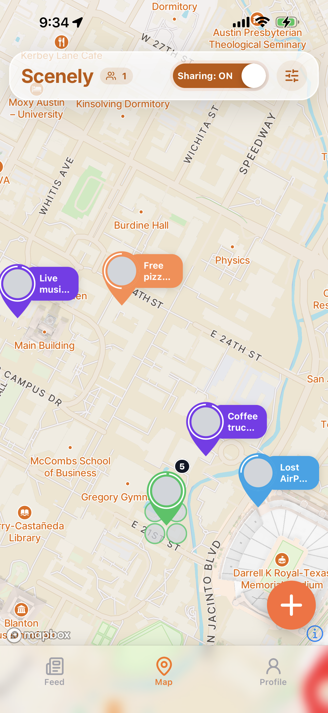
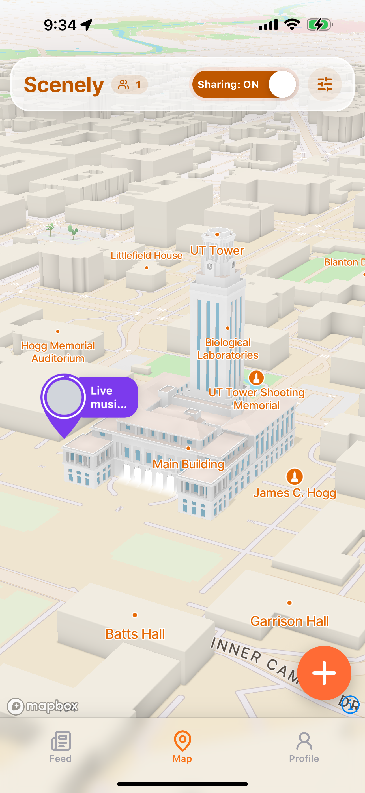
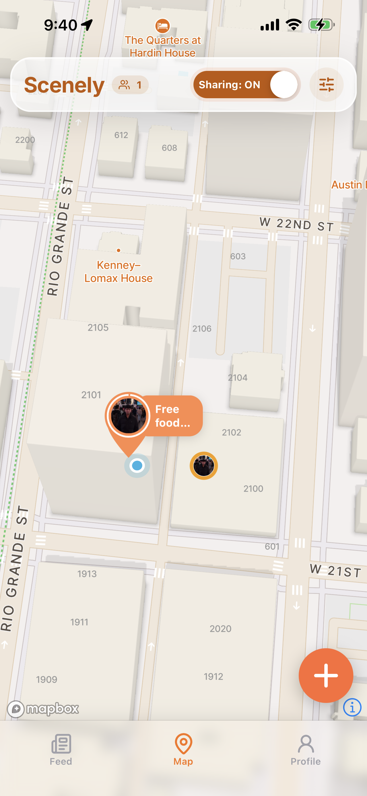
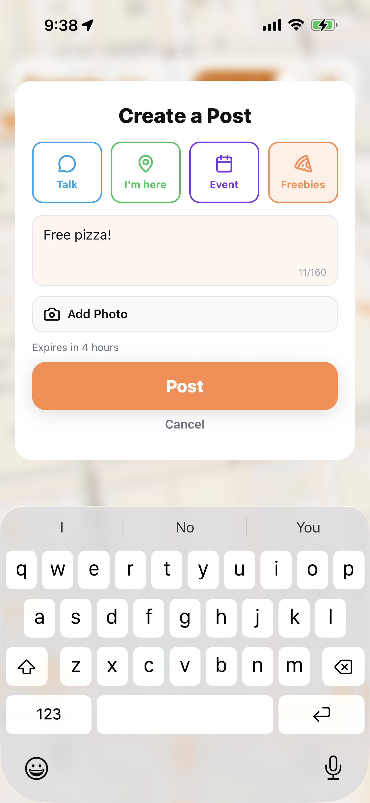
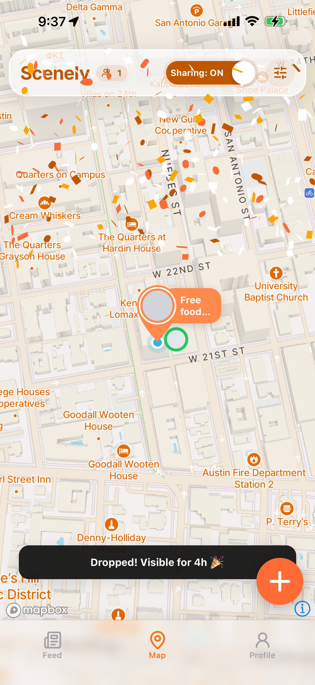
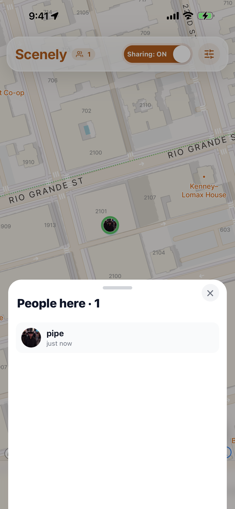
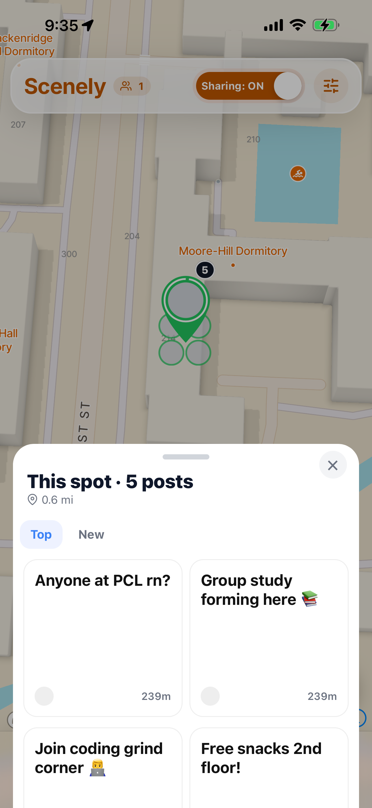
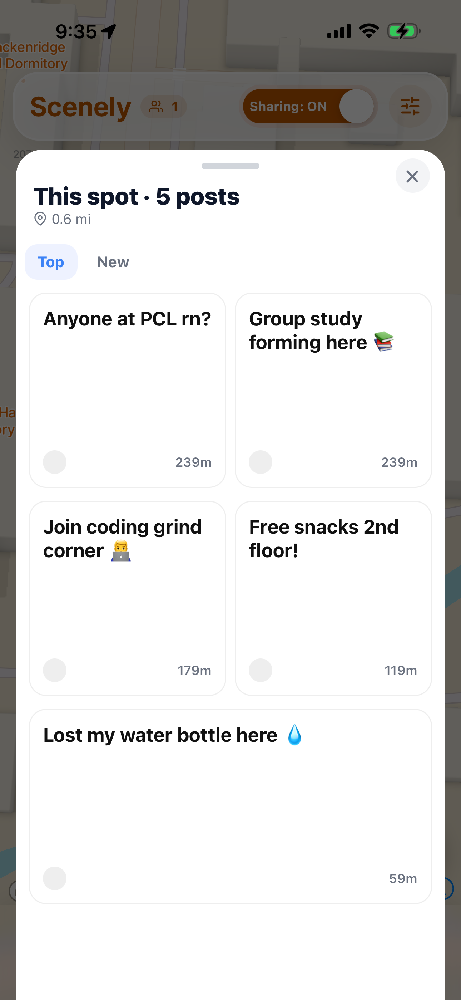
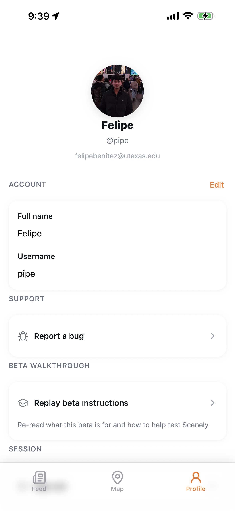

# Scenely

Scenely is a campus live-map social app built for college students to see what is happening around them in real time.

Instead of scrolling through disconnected posts, students can explore a map of their campus and discover nearby events, moments, crowds, and social activity based on location. The goal is to make campus feel more alive, connected, and immediate.

> Built with React Native, Expo, Supabase, PostgreSQL, and Mapbox.

---

## Screenshots

### Map Experience

<p align="center">
  
  
  
</p>

### Posting & Location Flow

<p align="center">
  
  
  
</p>

### Clusters, Feeds, and Profiles

<p align="center">
  
  
  
</p>

---

## Overview

Scenely is designed around a simple idea: campus activity should be visible where it is happening.

Students can open the app, view a live map of nearby posts, and instantly understand what is going on around campus. Whether it is a popular spot, a funny moment, a study area, a party, or a student event, Scenely brings location-based social discovery into one shared campus experience.

The app was built from the ground up as a mobile-first platform with real-time geospatial functionality, authentication, database-backed posts, and interactive map features.

---

## Features

- Live campus map with location-based posts
- Interactive map pins for nearby activity
- User authentication
- Create and view posts tied to specific locations
- Real-time backend powered by Supabase
- Geospatial data storage using PostgreSQL
- Mobile-first interface built with React Native
- Map rendering and location features using Mapbox
- Designed for college campus communities
- Scalable structure for moderation, events, profiles, and social features

---

## Tech Stack

### Frontend

- React Native
- Expo
- TypeScript / JavaScript
- Mapbox Maps SDK
- React Navigation

### Backend

- Supabase
- PostgreSQL
- Supabase Auth
- Row Level Security
- Geospatial data modeling

### Tools

- Git / GitHub
- EAS Build
- iOS Simulator
- Environment-based configuration
- Mobile debugging and testing tools

---

## Architecture

Scenely uses a mobile client connected to a Supabase backend.

The React Native frontend handles the user interface, map rendering, location-based interactions, and post creation flow. Supabase manages authentication, database storage, and backend access control. PostgreSQL stores structured app data, including posts, users, timestamps, and location coordinates.

```txt
React Native App
      |
      |-- User Authentication
      |-- Map UI / Location Features
      |-- Post Creation / Viewing
      |
Supabase Backend
      |
      |-- PostgreSQL Database
      |-- Auth
      |-- Row Level Security
      |-- Geospatial Data
      |
Mapbox
      |
      |-- Interactive Campus Map
      |-- Map Pins
      |-- Location Rendering
```

---

## My Role

I built Scenely as the technical co-founder and sole developer.

My work included:

- Architecting the mobile app from the ground up
- Building the React Native frontend
- Designing the Supabase/PostgreSQL schema
- Implementing authentication
- Integrating Mapbox for interactive map functionality
- Modeling location-based posts and geospatial data
- Creating the core user flows
- Managing frontend/backend integration
- Testing the app with early beta users
- Iterating on product direction based on feedback and campus traction

---

## Product Motivation

Most social platforms are feed-first. Scenely is map-first.

On a college campus, location matters. Students want to know what is happening nearby, what places are active, and where people are gathering. A traditional feed does not capture that context well.

Scenely turns campus activity into a visual, location-based experience.

The app is built around three core principles:

1. **Discovery should be immediate**  
   Students should be able to open the app and instantly see what is happening nearby.

2. **Campus should feel alive**  
   Posts become more meaningful when they are tied to real places.

3. **Social activity should be contextual**  
   A post on a map tells you not just what happened, but where it happened.

---

## Early Traction

During early testing and campus launch experiments, Scenely gained strong initial interest among UT Austin students.

- 25 active beta testers within the first week
- 180+ waitlist signups
- 500k+ impressions across social platforms
- #1 Hot on YikYak at UT Austin
- Tested with real student feedback and campus-specific use cases

---

## Key Technical Challenges & Optimizations

### Location-Based Data

A major challenge was designing posts around physical locations rather than a normal chronological feed. This required structuring post data with latitude, longitude, timestamps, user references, expiration behavior, and map rendering logic.

Because the app is map-first, location was not just metadata. It directly affected how posts were grouped, ranked, displayed, and interacted with.

---

### Map Rendering Performance

Rendering map pins at scale was one of the biggest technical challenges in Scenely.

An early implementation used JSX-based Mapbox `MarkerView` components for posts. This gave the pins more visual flexibility, but it did not scale well because rendering many React components on top of the map caused performance issues during pan and zoom interactions.

To solve this, I implemented a hybrid rendering system:

- GPU-rendered Mapbox sprites for most pins
- JSX markers only for the highest-priority posts near the camera
- Separate rendering layers for sprites, upgraded markers, live users, and clusters

This created a better balance between performance and visual quality. Sprites handled large amounts of map data efficiently, while JSX markers were reserved for the posts that needed richer UI.

---

### Hybrid Sprite + JSX Marker System

Scenely uses a hybrid marker strategy to avoid choosing between performance and design quality.

The system works by rendering most posts as lightweight Mapbox symbol sprites. Then, a small top-N set of visible posts near the camera is upgraded into richer JSX markers with custom UI.

This lets the app keep the map smooth while still showing polished, branded post pins where the user is most likely to focus.

Key decisions included:

- Use sprites for high-volume rendering
- Use JSX markers for visually important posts
- Hide upgraded JSX posts from the sprite layer to prevent duplicates
- Keep marker keys stable to reduce flicker
- Separate post pins from live-user markers and clusters

Result:

- Better map performance
- Cleaner visual hierarchy
- Less React rendering overhead
- More polished pins without sacrificing scalability

---

### Clustering Optimization: O(n²) to O(n)

Early clustering logic compared posts against each other directly, which created an O(n²) approach. That became inefficient as the number of posts increased.

I replaced this with a grid-based spatial hashing system.

Instead of checking every post against every other post, the map space is divided into fixed-size grid cells. Posts are placed into buckets based on their coordinates, and clustering happens within nearby cells rather than across the entire dataset.

This reduced clustering complexity from O(n²) to approximately O(n).

Result:

- Faster clustering
- Better scalability as post count grows
- Smoother interaction during map movement
- More reliable performance for high-activity campus areas

---

### Viewport-Based Top-N Selection

Instead of ranking every post globally, Scenely prioritizes posts based on what the user can actually see.

The app uses viewport-based top-N selection, meaning only posts inside the current map view compete to be upgraded into richer markers. Posts outside the visible frame do not affect what gets highlighted.

This fixed cases where off-screen posts could incorrectly compete with visible posts and prevented expiring or nearby posts from being visually deprioritized.

Result:

- More intuitive map behavior
- Less unnecessary computation
- Better alignment between rendering priority and user attention
- Cleaner post visibility during pan and zoom interactions

---

### Stable Marker Rendering & Flicker Reduction

Frequent map updates can cause markers to remount, flicker, or disappear if keys and rendering layers are not handled carefully.

I stabilized marker keys and separated the sprite and JSX marker systems to reduce unnecessary re-renders. I also fixed issues where dynamic icon image lookups caused sprites to disappear across zoom levels.

Result:

- Stable pins during pan and zoom
- Reduced marker flicker
- More consistent cluster and pin visibility
- Cleaner user experience during active map interaction

---

### Live Location System: Efficiency + Privacy

Live location sharing required balancing accuracy, performance, and privacy.

Instead of constantly streaming exact location updates, Scenely uses a controlled heartbeat-based system with coarse location handling.

The system includes:

- Approximate grid-based location sharing
- Stable per-user jitter to avoid exposing exact coordinates
- Movement-based updates
- Time-based heartbeat updates
- Adaptive polling and backend rate limiting

Location updates are only sent when the user has moved far enough or enough time has passed. This keeps the live map feeling active without constantly writing to the database.

Result:

- Lower backend load
- Better battery and network behavior
- More privacy-conscious live location sharing
- Real-time presence without excessive database writes

---

### Live User Presence

Scenely separates live user presence from live location sharing.

Instead of using location sharing alone to determine who is online, the app tracks live presence through heartbeats. This allows the app to show a more accurate online user count without depending only on whether a user is actively sharing their location.

Result:

- More accurate online user count
- Cleaner distinction between being online and sharing location
- Better foundation for future social features

---

### Dynamic Clustering & Visual Encoding

Clusters needed to communicate density without cluttering the map.

I implemented custom clustering behavior for posts and live users, including:

- Same-location post grouping
- Hero post selection
- Petal-style avatars around clusters
- Count overlays for grouped activity
- Bottom sheets for viewing clustered posts

This made clusters feel more visual and social instead of looking like generic map markers.

Result:

- Higher information density without overwhelming the screen
- Clearer visual hierarchy
- Better interaction when multiple posts or users exist near the same location

---

### Real-Time Data Synchronization

Scenely uses Supabase realtime listeners to keep the app updated without requiring constant full refreshes.

Realtime updates are used for:

- New posts
- Deleted posts
- Likes
- Comments
- Count updates across map and feed surfaces

A major challenge was keeping the map, feed, post sheets, and bottom sheets consistent without causing unnecessary re-renders. The app uses selective state updates and local reconciliation so user interactions stay responsive.

Result:

- Faster UI updates
- Reduced network waste
- More consistent post/feed state
- Better user experience during active campus usage

---

### Backend Security

Because Scenely handles user-generated content, authentication, profiles, and location-based data, backend security was a major part of the design.

The app uses Supabase Auth and PostgreSQL access rules to control how users create, read, update, and delete data.

Security-related work included:

- UT-only email authentication
- Persistent authentication sessions
- Secure session storage
- Profile ownership rules
- Post deletion limited to authors
- Account deletion flow
- Local and secure storage cleanup on sign-out/delete

Result:

- Safer user account handling
- Better protection around user-generated content
- Cleaner data ownership model

---

### Mobile Development Workflow

The project uses Expo and EAS builds, which required managing native dependencies, environment variables, Mapbox tokens, and simulator/device testing.

A major part of the workflow involved debugging mobile-specific issues that do not always appear in normal web development, including:

- iOS simulator behavior
- Mapbox native setup
- Expo dev client configuration
- Package version compatibility
- Keyboard-aware input behavior
- Hardware keyboard vs. software keyboard differences
- Native dependency updates

Result:

- More reliable mobile development process
- Better compatibility with iOS testing
- Cleaner production path for real device builds

---

### Observability & Product Analytics

Scenely includes analytics and error monitoring to better understand product behavior and app stability.

I added:

- PostHog analytics for product usage tracking
- Sentry for error monitoring and debugging

This gave the project a stronger foundation for beta testing because issues could be tracked from real usage instead of only from local development.

Result:

- Better visibility into app behavior
- Easier debugging during beta testing
- Stronger feedback loop for product iteration

---

## Why These Optimizations Matter

Map-based social apps can become slow quickly because they combine user-generated content, geospatial computation, real-time updates, and heavy visual rendering.

Scenely addresses those problems through:

- Hybrid rendering with GPU sprites and JSX markers
- Grid-hash clustering instead of O(n²) clustering
- Viewport-based top-N selection
- Stable marker keys and separated rendering layers
- Heartbeat-based live presence
- Privacy-conscious live location design
- Selective realtime updates

These decisions help the app stay smooth, responsive, and scalable as campus activity increases.

---

## What I Learned

Building Scenely strengthened my experience in full-stack mobile development, product engineering, and startup-style execution.

The project required more than just writing frontend screens. I had to think through database design, authentication, geospatial features, mobile build systems, user behavior, product positioning, and real-world testing.

It also helped me understand how technical decisions affect product speed. Building a location-based social app meant constantly balancing performance, simplicity, user experience, and scalability.

---

## Status

Scenely is currently in beta development and early campus testing.

---

## Author

**Felipe Benitez**  
Computer Science + Data Science Student at The University of Texas at Austin  
Technical Co-Founder / Sole Developer of Scenely

- LinkedIn: https://www.linkedin.com/in/benitezfelipe/
- GitHub: https://github.com/FelBenitez

---

## License

This project is currently private/proprietary. All rights reserved.